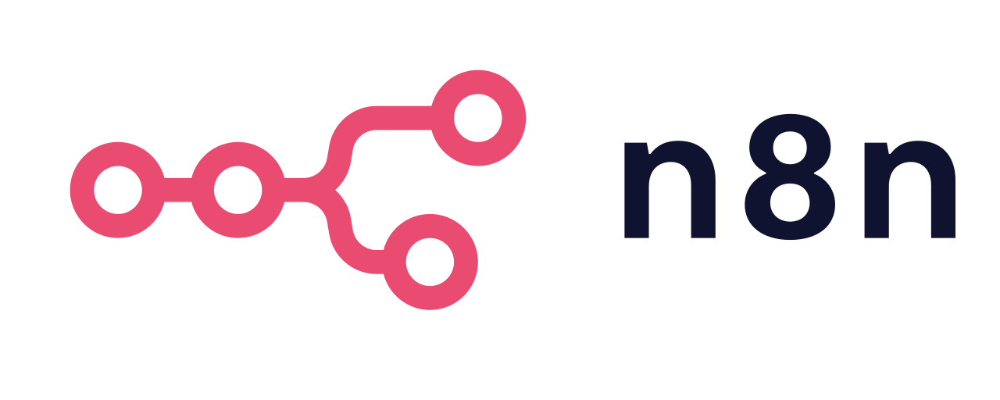
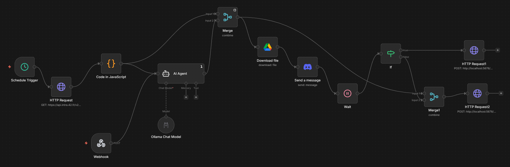
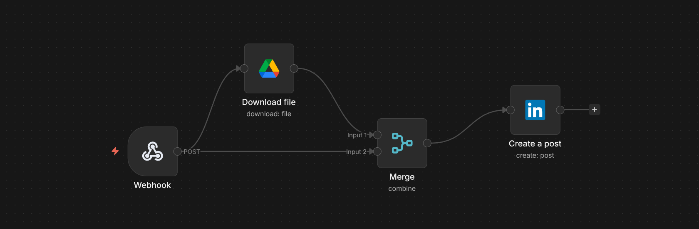

# linkedin-autoposter-from-my-school-api

An n8n automation that detects when a project is validated via my school's API and automatically generates and publishes a LinkedIn post with AI-generated content, a Discord approval step, and image fetching from Google Drive. Everything runs locally, no paid APIs, no cloud dependencies.
 
---
 
## What it does in a nutshell
 
Every few minutes, a scheduler polls the school API to check if a new project has been validated. If yes, it sends the project data to a local AI model that generates a personalized LinkedIn post. It then fetches the project cover image from Google Drive, sends a full preview to a Discord bot, and waits for approval. You can approve or reject the post as many times as you want, it keeps regenerating until you're satisfied, then publishes to LinkedIn automatically.
 
**Two workflows exists in my project:**
- **Workflow 1: 42 Project Detector**: handles everything from API polling to Discord approval

- **Workflow 2: LinkedIn Publisher**: triggered by Workflow 1 on approval, posts to LinkedIn

## Tech stack
 
| Tool | Usage |
|---|---|
| [n8n](https://n8n.io) | Automation engine (self-hosted) |
| School API | Fetching project validation data via OAuth2 |
| [Ollama](https://ollama.com) + Llama 3.2 | Local AI post generation |
| Google Drive API | Fetching project cover images |
| Discord API | Human-in-the-loop preview and approval |
| LinkedIn Share API | Publishing the final post |
| Webhooks | Bridges between the two workflows |
 

 ## Prerequisites
 
- [n8n](https://docs.n8n.io/hosting/) self-hosted on your machine
- [Ollama](https://ollama.com) installed with Llama 3.2 pulled (`ollama pull llama3.2`)
- A school OAuth2 app (client ID + secret)
- A Google Cloud project with Drive API enabled
- A Discord bot with `Send Messages` and `Attach Files` permissions
- A LinkedIn account with API access
 

 ## Setup
 
> 💡 **Want to understand OAuth2 visually?** This is the best resource I found:
> [An Illustrated Guide to OAuth and OIDC](https://developer.okta.com/blog/2019/10/21/illustrated-guide-to-oauth-and-oidc#thats-not-all-folks-please-welcome-openid-connect) (highly recommend it if OAuth2 is new to you.)
 
### 1. School API credentials
- Create an OAuth2 app on your school's developer portal
- Set the redirect URI to `http://localhost:5678/rest/oauth2-credential/callback`
- Copy the `client_id` and `client_secret`
- In n8n, create a **Generic OAuth2** credential with:
  - Authorization URL: `https://api.intra.42.fr/oauth/authorize`
  - Access Token URL: `https://api.intra.42.fr/oauth/token`
  - Scope: `public`
 
### 2. Google Drive credentials
- Create a project on [Google Cloud Console](https://console.cloud.google.com)
- Enable the **Google Drive API**
- Create an **OAuth2 Web Application** credential
- Add `http://localhost:5678/rest/oauth2-credential/callback` as an authorized redirect URI
- Add your email as a test user under **Google Auth Platform → Audience**
- Paste the client ID and secret into the n8n Google Drive credential
 
### 3. Discord bot
- Create an app on [Discord Developer Portal](https://discord.com/developers/applications)
- Create a bot and copy the token
- Enable `Send Messages` and `Attach Files` permissions
- Invite the bot to your server
- Enable Developer Mode in Discord and copy your channel ID
 
### 4. Google Drive images
- Create a folder called `1337projects` in your Google Drive
- Add project cover images named exactly after the project slug in lowercase (e.g. `netpractice.png`, `ft_printf.png`)
 
### 5. Import workflows
- Import both workflow JSON files into n8n
- Configure all credentials in each node
- Activate both workflows

## Notes
 
- Llama 3.2 running on CPU is slow. For better performance use a GPU or swap to a cloud API (Claude, GPT etc.)
- The dedup system uses n8n static workflow data to store the last validated project timestamp, preventing double posting
- Both workflows must be **Active** for the approval webhooks to work correctly
 